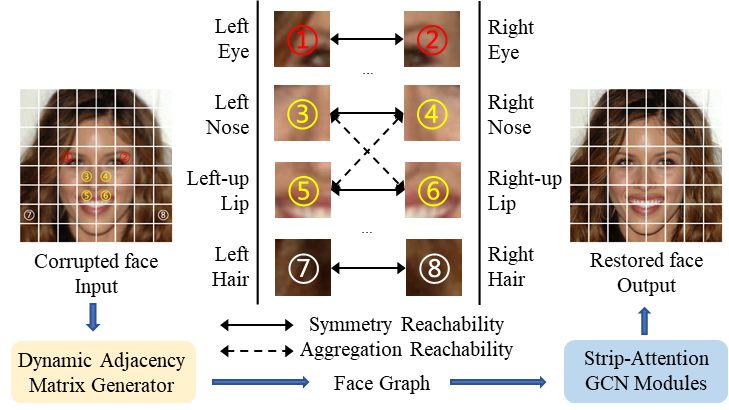

# FaceGCN (Under Review)
---
FaceGCN: Structured Priors Inspired Graph 
Convolutional Networks for Blind Face Restoration

The pipeline of FaceGCN for blind face restoration. The corrupted face (Input) in the feature domain is firstly constructed into a face graph with case-specific guidance from the Dynamic Adjacency Matrix Generator. Then, some Strip-Attention GCN Modules are stacked to finally produce the restored face (Output) benefiting from the captured joint local-nonlocal correlations among various facial feature components.

## Dependencies
+ Python 3.6
+ PyTorch >= 1.7.0
+ matplotlib
+ opencv
+ torchvision
+ numpy

## Datasets are provided in [here](https://github.com/wzhouxiff/RestoreFormer?tab=readme-ov-file#preparations-of-dataset-and-models)

## Train and Test (based on [Basicsr](https://github.com/XPixelGroup/BasicSR))

    python facegcn/train.py -opt options/train/train_stage_1.yml --auto_resume
    python facegcn/train.py -opt options/train/train_stage_2.yml --auto_resume
    python facegcn/test.py -opt options/test/test_xxx.yml

**ps: the path configs should be changed to your own path**

